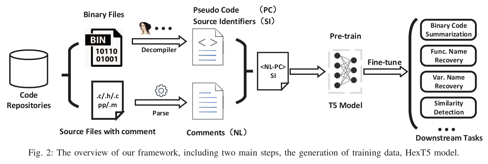

# HexT5: Unified Pre-Training for Stripped Binary Code Information Inference

## Overview



HexT5 is a unified pre-training model designed to enhance the semantic inference of stripped binary code by leveraging vast amounts of natural language, source identifiers, and pseudo-code.

## Usage

Use `hext5_generation.py` to generate **summaries** or **identifier name** for decompiled pseudo code. 

You can access the model weight from [zenodo](https://xxx).

If you find this work are helpful, please consider cite our paper:

```bibtex
@INPROCEEDINGS{10298504,
  author={Xiong, Jiaqi and Chen, Guoqiang and Chen, Kejiang and Gao, Han and Cheng, Shaoyin and Zhang, Weiming},
  booktitle={2023 38th IEEE/ACM International Conference on Automated Software Engineering (ASE)}, 
  title={HexT5: Unified Pre-Training for Stripped Binary Code Information Inference}, 
  year={2023},
  volume={},
  number={},
  pages={774-786},
  keywords={Computer languages;Semantics;Natural languages;Binary codes;Object recognition;Data mining;Task analysis;Reverse Engineering;Deep Learning;Binary Diffing;Information Inference;Programming Language Model},
  doi={10.1109/ASE56229.2023.00099}}
```